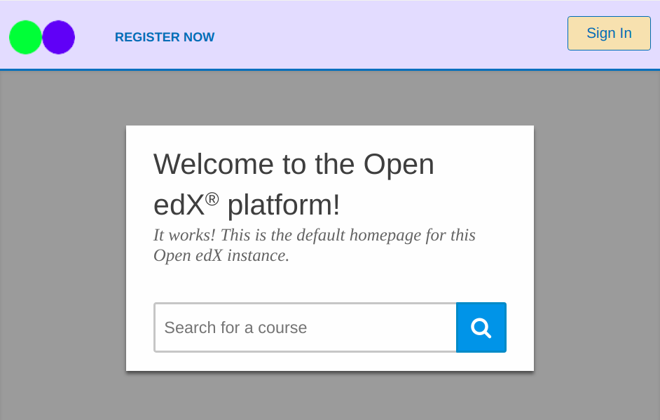

# Blue Theme
A sample comprehensive theme for the edX Platform.

This theme is based on the Ginkgo's
[`red-theme` in the edX platform repo](https://github.com/edx/edx-platform/blob/open-release/ginkgo.master/themes/red-theme/).

## How to Use
- As the `edxapp` user go to `/edx/app/edxapp/themes`
- Clone this theme `$ git clone https://github.com/appsembler/blue-theme.git`
- Configure the `lms.env.json` with the following variables:
  * `ENABLE_COMPREHENSIVE_THEMING` to `true`
  * `COMPREHENSIVE_THEME_DIRS` to `["/edx/app/edxapp/themes"]`
  * `DEFAULT_SITE_THEME` to `blue-theme`
- Stop the LMS server if it's started
- Start the LMS server again: `$ paver lms`

### Preview

## License
The code in this repository is licensed under version 3 of the AGPL
unless otherwise noted. Please see the `LICENSE.txt` file for details.
